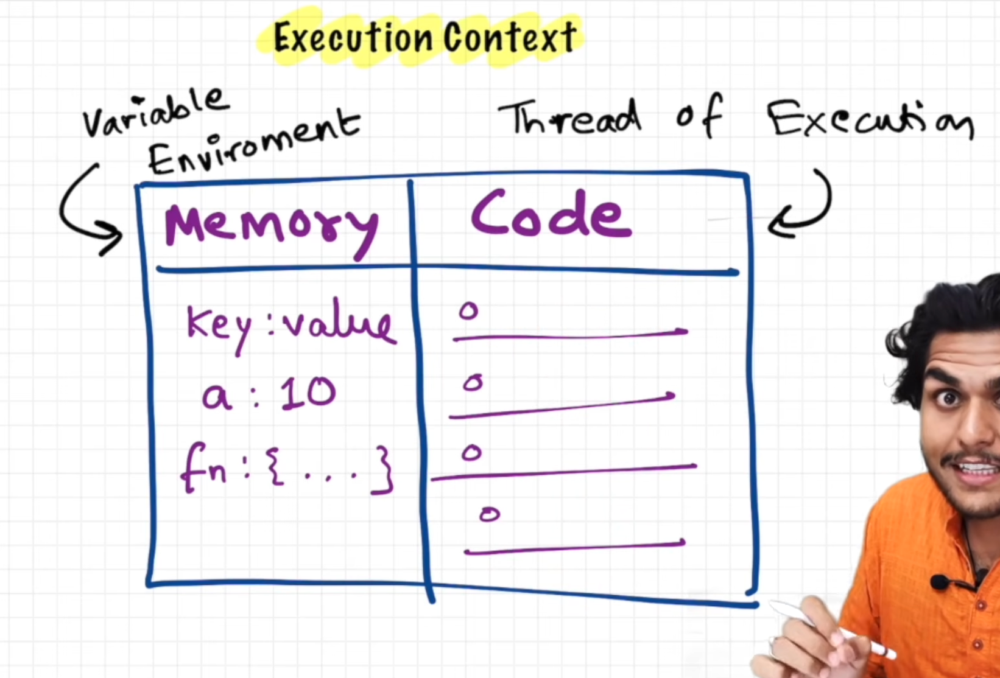

# How Javascript Works & Execution Context

### Everything in JS happens inside an Execution Context.

- Execution Context is the runtime environment created by the JavaScript engine to execute code. It contains all the information the JavaScript engine needs to run the current piece of code.

    It contains:

    - Variables `(let, const, var)`
    - Function declarations
    - The value of `this`
    - The scope chain (access to outer variables)
    - Information about where execution currently is

- EC is like a big box, and it has two components in it:
    1. **Memory Component (or Variable Environment)** : This is the place where all the variables and functions are stored as key value pairs.
    2. **Code Component (or Thread of Execution)**: This is the place where code executes one line at a time.
    

### Javascript is a **synchronous single-threaded language.**

    - Single-threaded: that means JS can execute one command at a time.
    - Synchronous: JavaScript executes code line by line, waiting for the current statement to finish before moving to the next.

    So Synchronous single-threaded means Javascript can execute one command at a time and in a specific order i.e., it only go to next line when current line has been finished executing. That means synchronous single-threaded language.